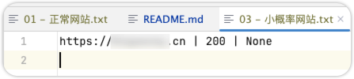

# SiteLiveScan

SiteLiveScan是一款探测网站存活概率的工具，批量对目标网站(域名或ip:port)进行扫描，筛选出存活站点。

## 主要功能

- 使用异步协程批量快速扫描
- 根据站点返回的status_code、访问站点随机路径返回的status_code进行比对，判断站点存活概率
- 结果支持导出CSV、html格式

## 基础环境准备

1. 安装python3.11+
2. 安装依赖库：`pip install -r requirements.txt`

## 使用方法

```shell
python3 SiteLiveScan.py -f urls.txt
扫描结果保存路径在conf/config.py进行配置
```

## 扫描结果分类：

默认保存在results目录：

- 正常网站： 响应码 20x  、30x为主，个别 40x
- 大概率正常网站：404为主，少量其他常见响应码
- 小概率正常网站：403为主，少量其他常见响应码
- 异常网站，服务端异常：50x为主
- 不太常见的响应码：个别常见响应码会出现在这个分类，如：401、200等

**效果图：**




## 技术原理

通过多因素分析常见的响应码，进行网站存活状态进行分析。

网站是否有潜在利用价值

- 200相关

> 需要结合页面关键字、响应headers content-length、页面相似度等判断网站状态

- 30x

> 允许requests 跳转，获取title

- 403相关
  如果网站根目录扫描返回403？此时访问根目录url+随机字符：

> 1. 如果返回403，则有一定概率是除了根目录下的某些资源可能访问外，访问其他资源都返回403
> 2. 如果返回404，则有一定概率是，网站默认首页文件配置错误

- 404相关

> 如果网站根目录扫描返回404？此时访问根目录url+随机字符：
> 如果返回404，可能根目录下除了某些资源可访问外，其他都返回404

- 50x

> 重试处理，可能网站某段时间服务端异常，需要多次请求才能判断

## 版本更新

V1.0.0 2024-06-05

- 修复报错：`ModuleNotFoundError: No module named 'httpx.exceptions'`
- 修复报错：`TypeError: Passing coroutines is forbidden, use tasks explicitly.`
- 修复报错：`AsyncClient.get() got an unexpected keyword argument 'allow_redirects'`
- 修复Bug：结果文件、日志文件写入报错
- 代码优化

## 后续计划

- 检测结果支持响应内容大小进行排序，一般内容大小一样，都是相同的页面，检查一个，即可忽略其他urls
- 增加导出结果支持：csv、json、
- 支持推送结果到接口
- 提供webhook接口，支持接口推送urls

## 常见问题

待补充~

## 版权声明

SiteLiveScan 本软件，通过BigYoung购买专栏后，有权进行个人使用，禁止公开发布和用于商业用途，否则BigYoung有权追究法律责任。

## 免责声明

SiteLiveScan 仅供学习交流使用，禁止用于非法用途，否则后果自负。

## 下载地址&获取最新版

[https://afdian.net/a/bigyoung?tab=shop](https://afdian.net/a/bigyoung?tab=shop) 页面搜“SiteLiveScan”
